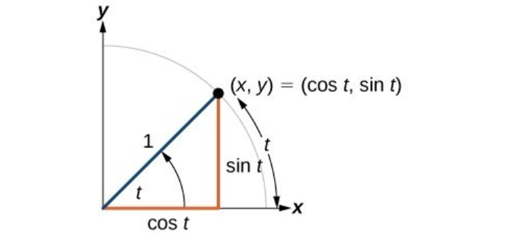
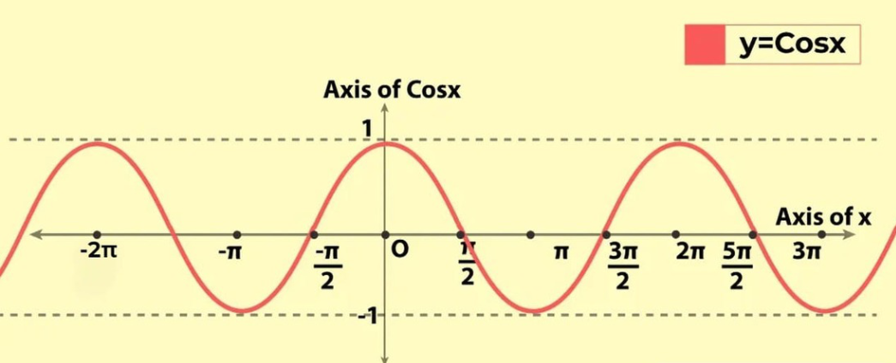
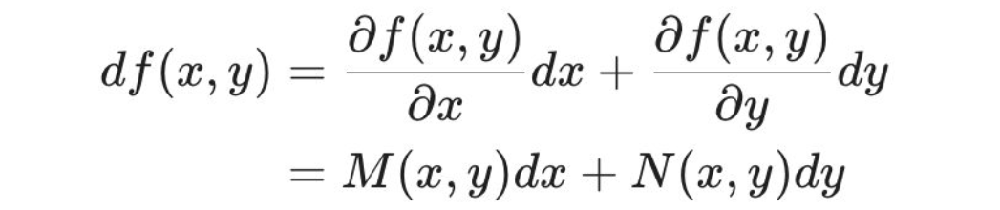

## 1. 함수 Function

### 역함수

$y = f(x) = ax + b$ 와 같이 $y = f(x)$ 함수가 있을 때 x 와 y의 순서를 바꾼 것.
$x = f(y)$ 로 한 후 식을 정리하면 역함수가 된다.
역함수는 기존의 함수와 $y = x$에 대해 대칭이다.

 

### 미분

미분과 관련돼 알면 좋은 공식들

1. **미분의 선형성** $(p \times f(x) + q \times g(x))' = p \times f'(x) + q \times g'(x)$
2. **다항식의 미분** $(x^r)' = r \times x^{r-1}$
3. **곱의 미분** $(f(x)g(x))' = f'(x)g(x) + f(x)g'(x)$
4. **연쇄 법칙** $\frac{dy}{dx} = \frac {dy}{du} \times \frac {du}{dx}$
5. **역함수의 미분** $\frac{dy}{dx} = \frac{1}{\frac{dy}{dx}}$
6. 몫의 법칙 $(\frac{f(x)}{g(x)})' = \frac{f'(x)g(x) + f(x)g'(x)}{g(x)^2}$

 

## 2. 벡터 Vector

벡터는 **방향과 크기를 가진 양**이다.
각 차원(elements in array)이 방향을 말하고 차원에 적힌 값이 크기이다.
이때 벡터 내의 방향들의 크기를 '성분'이라고 한다. a = (a1, a2)라는 벡터가 있을 때 벡터 a는 2차원 벡터이고 성분은 각각 a1, a2인 것이다.

기하학적으로 표현할 때는 2차원이 가장 이해하기 쉽고 4차원 이상부터는 표현이 어렵다. 따라서 기하학적인 이해는 2차원 혹은 3차원으로 나타낸다. 중요한 점은 2차원이든 100차원이든 수식적으로는 똑같은 성격을 가진다는 것이다. 따라서 직관적인 이해는 기하학적으로 진행하되 얼마든지 scaling할 수 있다는 것이 선형대수학의 가장 큰 특징이다.

벡터의 중요한 특징 중 하나는 평행이동이 가능하다는 점이다. 즉, 시작점이 어디든 상관없이 방향과 크기가 같다면 같은 벡터로 취급한다. 벡터는 위치에 상관없이 **방향과 크기만으로 정의**된다.

 

### 벡터의 길이

벡터의 길이는 피타고라스의 정리에 의해 각 성분의 제곱의 합에 루트를 씌운 것이다.

2차원의 경우
$|\vec{v}| = \sqrt{x^2 + y^2}$

일반화하면
$|\vec{v}| = \sqrt{v_1^2 + v_2^2 + \cdots + v_n^2}$
이다.

 

### 벡터의 거리

벡터의 거리란, 두 벡터가 있을 때 각 성분끼리의 차이의 제곱을 모두 더한 후 루트를 씌운 것이다.

즉 벡터 a와 b가 있고 두 벡터가 같은 차원이라고 가정할 때

$d(\vec{a}, \vec{b}) = \sqrt{(a_1-b_1)^2 + (a_2-b_2)^2 + \cdots + (a_n-b_n)^2}$

인 것이다.

 벡터의 거리와 연결을 짓자면

$|\vec{v}| = \sqrt{(v_1-0)^2 + (v_2-0)^2 + \cdots + (v_n-0)^2}$

또한 수식적으로 같은 의미이기 때문에 **길이는 원점으로부터의 거리**라고 해석할 수도 있다 (내가 직접 생각함).

 

### 삼각함수

radius(r)를 빗변으로 갖고 내각이 θ인 직각삼각형

이때 
$sinθ =  \frac{r}{y}$
$cosθ =  \frac{r}{x}$
$tanθ = \frac{y}{x}$

여기서 양변에 r을 곱하면
$y = sinθ \times r$
$x = cosθ \times r$
이 된다.

따라서 r =1일때

$sinθ = y$ (높이)
$cosθ = x$ (길이)

가 된다.

 

### **내적 Dot Product**

*딥러닝을 이해하는 데 굉장히 중요한 요소이자 이해가 어려웠던 부분 중 하나이다.*

1) **$a·b = |a||b|cosθ$**

*두 벡터의 방향이 얼마나 일치하는가, 얼마나 같은 방향인가*를 계산
-> 내적을 구하는 이유는 **두 값 사이의 유사도를 수학적으로 계산**할 수 있기 때문이다.

**내적에서 사용되는 `·` 는 `*` 스칼라 곱셈과 전혀 다른 의미이다.**

내적의 기하학적 정의는:

1. 한 벡터를 다른 벡터 방향으로 투영하고
2. 그 투영된 길이와 다른 벡터의 길이를 곱한 것입니다

그래서:

- $|b|cosθ$: b벡터를 a방향으로 투영한 길이
- $|a|$: a벡터의 길이
- 이 둘을 곱한 것이 내적

여기서 일반 곱셈(`*`)이 사용되긴 하지만, 그것은 내적을 계산하는 과정에서 사용되는 것일 뿐입니다. 내적 연산 자체의 정의는 "한 벡터를 다른 벡터 방향으로 투영한 성분들의 곱"이라는 완전히 독립적인 개념입니다.

 

이때 cosθ 관점에서 보면:

r = 1인 삼각함수에서
- cosθ = 1 일 때 (θ = 0°) : 100% 같은 방향
- cosθ = 0 일 때 (θ = 90°) : 0% (서로 수직)
- cosθ = -1 일 때 (θ = 180°) : -100% (정반대 방향)

가 된다.

 

그래프로 확인해보아도 이 내용들을 확인할 수 있다.

 

#### **2) $a·b = a_1b_1 + a_2b_2 + ... a_nb_n$**

**벡터의 각 성분끼리의 곱의 합도 내적이다!**

내적의 정의는 위에서 설명한 **$a·b = |a||b|cosθ$** 이다. 
이 두 번째 식은 수학적인 증명을 통해 구할 수 있다.

proof: 1) **내적의 선형성**과 2) **축의 분해**(one hot encoding) 를 통해 증명이 가능하다.

1) **내적의 선형성**이란, 임의의 벡터 a,b,c에 대해 a · (b + c) = a · b + a · c 가 성립하는 것을 말한다.

2) 이해의 편의를 위해 임의의 두 2차원 벡터 $a=(a_1,a_2)$와 $b=(b_1,b_2)$에 대해 x축 성분과 y축 성분을 독립적으로 갖도록 분해해보자 (어차피 n차원 벡터도 똑같이 일반화가 가능하다):

벡터의 정의(방향과 크기를 가진 양) 에 따라 $a=(a_1,a_2)$ 는 두 차원에 각각 $a_1$, $a_2$를 가진 벡터이다. (b 또한 마찬가지)

어차피 벡터는 벡터의 구성요소의 합과 같기 때문에 벡터를 다음과 같이 한 축(차원)에 대해서만 쪼개서 표현할 수 있다:

$a_i = (a_1, 0)$
$a_{ii} = (0, a_2)$
$a_i + a_{ii} = a$

$b_i = (b_1, 0)$
$b_{ii} = (0, b_2)$
$b_i + b_{ii} = b$

1에서 설명한 내적의 선형성 때문에 $a · b = (a_i + a_ii) · (b_i + b_ii) = a_i·b_i + a_i·b_ii + a_ii·b_i + a_ii·b_ii$ 가 성립한다.

이때 $a_i·b_{ii}$와 $a_{ii}·b_i$는  $θ = 90°$ (2차원상 수직)이므로 $cosθ = 0$이고
$a_i, b_i$와 $a_{ii}, b_{ii}$의 경우 같은 축 상의 벡터들이고 $θ = 0°$ 이므로 $cosθ = 1$이 된다.

따라서 식을 정리하면
$a · b = a_i·b_i + a_{ii}·b_{ii} = a_1 · b_1 + a_2 · b_2$

위 두 가지 중간결과를 통해 코사인 유사도 식은 다음과 같이 표현된다. 

$similarity = \cos(\theta) = \frac{\vec{a} \cdot \vec{b}}{|\vec{a}| |\vec{b}|} = \frac{\sum_{i=1}^{n} a_i b_i}{\sqrt{\sum_{i=1}^{n} a_i^2} \sqrt{\sum_{i=1}^{n} b_i^2}}$

**내적을 통해 알 수 있는 것: $cosθ$ 는 최대 1, 최소 -1 을 가지고 최대인 경우는 완전히 겹치는 것이므로 $cosθ$가 클수록 비슷한 방향을 나타내고 있다고 볼 수 있다.**

 

## 미분

편미분을 하기 위해서는 어느 지점에서 하는지에 대한 정보가 꼭 필요하겠네?

 

### 전미분 total difference

미분의 정의: $\frac {f(x + dx) - f(x)} {dx} = f'(x)$

여기에서 양변에 dx를 곱하면
$f(x + dx) - f(x) = f'(x)dx$
즉 $dy = f'(x)dx$

이때 우변($f'(x)dx$)은 `순간변화율 x 변화량`이 되는 것이다.

이를 다변수함수에 적용하면 함수의 각 변수에 대한 편미분이 각 변수에서의 순간변화율이 된다. 즉  $L_u$가 변화율, $du$가 변화량이다.

따라서 $L(u,v)$에 대하여 $L(u+du, v+dv) - L(u, v) = L_u(u,v) \times du + L_v(u,v) \times dv$ 임을 알 수 있다.

 

이를 정리하면

#### 왜 $du$가 $∂u$로 변하는 거임?

정확히 말씀하셨습니다! 이 상황에서 **du와 ∂u는 사실상 같은 것을 나타냅니다.**

위의 그림에서 나오는 변환 과정을 보면:
1. x₁, x₂, x₃ → u₁, u₂로의 변환
2. u₁, u₂ → L로의 변환

이 과정에서 u₁, u₂는 중간 변수이고, 이들의 변화량을 나타낼 때:
- du로 표현하든
- ∂u로 표현하든

결국 같은 변화량을 의미합니다. 식 (4.4.1)에서 (4.4.2)로 넘어갈 때 표기만 바뀌었을 뿐, 실제로 의미하는 것은 동일한 변화량입니다.

그래서 식 (4.4.1)의 du₁, du₂를 식 (4.4.2)에서 ∂u₁/∂x₁, ∂u₂/∂x₁로 바꿔 쓸 수 있는 것입니다.

 

#### 그럼 왜 애초에 du를 ∂u로 안 써? 헷갈리게

그것은 chain rule의 일반적인 표현 방식과 관련이 있습니다.

dL = (∂L/∂u₁)du₁ + (∂L/∂u₂)du₂ 형태는:

1. 더 일반적인 chain rule의 형태입니다
2. L의 변화가 u₁, u₂의 변화에 의해 어떻게 영향받는지를 직관적으로 보여줍니다
3. 전체 미분의 형태로서, 어떤 변수에 대해 미분하는지 아직 특정하지 않은 상태입니다

이후에 "x₁으로 편미분한다"는 구체적인 조건이 주어졌을 때:

- du₁은 ∂u₁/∂x₁ dx₁이 되고
- du₂는 ∂u₂/∂x₁ dx₁이 됩니다

즉, du 표현은 더 일반적인 상황에서 시작해서, 특정 조건(x₁에 대한 편미분)이 주어졌을 때 ∂u로 구체화되는 것입니다. 이는 수학적으로 문제를 더 체계적으로 접근하는 방식이라고 할 수 있습니다.

 

#### $L_u, L_v$ 를 어떻게 상수로 볼 수 있는가?

1. 일반적인 편미분: 함수 L(u,v,w)의 일반적인 편미분은 특정 지점을 지정하지 않고도 가능합니다. 예를 들어:
L(u,v,w) = u² + 2uv + w³ 의 경우
∂L/∂u = 2u + 2v ∂L/∂v = 2u ∂L/∂w = 3w²
이처럼 변수들의 관계식으로 표현되는 일반해를 구할 수 있습니다.

2. 특정 지점에서의 편미분값: 특정 지점에서의 구체적인 값을 구하고 싶다면, 그때는 지점 정보가 필요합니다. 예: (u,v,w) = (1,2,3) 지점에서의 ∂L/∂u 값

2번 케이스의 경우 변수들을 특정 지점에서의 고정된 값이기 때문에 상수 취급이 가능하다.

따라서 변하는 부분은 cosθ 뿐이고 cosθ가 180도 (역방향)를 이룰 때 손실이 최소(-1)가 되므로

함수 L의 극소 변화량 dL은 두 벡터가 이루는 각 θ에 의해 결정되고 함숫값이 최소가 되는 때는 벡터(Lu,Lv)와 벡터(du,dv)가 역방향일 때이다.
(이걸 입문서에서는 같은 방향(cosθ = 1일때)의 반대라고 표현한 것이다.)

### 로그함수에서는 밑의 값이 무엇이든 본질적인 차이는 없다.

"본질적인 차이가 없다"는 말은 로그함수에서 밑이 어떤 수가 되더라도, 결국은 다른 밑을 가진 로그값과의 비율로 표현된다는 의미입니다.

예를 들어:

- log₂X = log₁₀X / log₁₀2
- log₃X = log₁₀X / log₁₀3
- log₅X = log₁₀X / log₁₀5

이처럼 어떤 밑을 사용하든:

1. 항상 다른 밑의 로그값들의 비율로 표현할 수 있고
2. 그 비율 관계는 밑들 간의 로그값으로 결정됩니다
3. 따라서 특정 밑이 "특별하다" 거나 "더 근본적이다"라고 할 수 없습니다

즉, 모든 로그는 서로 상수배 관계에 있기 때문에, 밑의 선택은 단지 "스케일(scale)"의 차이일 뿐, 함수의 본질적인 성질을 바꾸지는 않는다는 의미입니다.

이걸 밑을 e(자연상수)를 갖는 로그에 적용하면 밑이 e가 아니더라도 비율을 통해 정규화할 수 있다는 건가?

네, 정확히 그렇습니다! 

자연로그(ln = loge)의 경우에도 같은 원리가 적용됩니다:
- **ln(X) = log₁₀X / log₁₀e**
- 또는 다른 관점에서: log₁₀X = ln(X) / ln(10)

이는 매우 중요한 의미를 가집니다:
1. 자연로그가 수학적으로 특별한 의미를 가지더라도(예: 미분했을 때 1/x가 되는 등), 계산 관점에서는 다른 로그와 비율 관계로 변환 가능합니다.
2. 따라서 어떤 밑의 로그든 자연로그로 "정규화"할 수 있고, 그 반대도 가능합니다.

이것이 바로 "밑의 변환 공식"이 주는 통찰이며, 로그함수에서 밑의 선택은 단지 스케일의 문제일 뿐, 함수의 근본적인 성질은 변하지 않는다는 것을 보여줍니다.

### 로그함수는 너무 큰 값이나 작은 값을 대등하게 다룰 수 있는 특수 필터 같은 기능을 합니다.

"로그함수가 너무 큰 값이나 작은 값을 대등하게 다룬다"는 표현은 정확하지 않습니다. 더 정확한 설명은:
- **로그함수는 큰 값들의 차이는 압축하고 작은 값들(0과 1 사이)의 차이는 오히려 확대하는** 비대칭적인 특성을 가진다고 할 수 있습니다.

 

밑이 e인 로그함수 y = f(x) = loge(x) 를 미분하면 f'(x) = 1/x이다.
e를 밑으로 하는 지수함수의 미분은 자기자신 (e^x)이 된다.

 

e를 밑으로 하지 않을 경우 자연상수를 밑으로 같도록 정규화해주면 된다.
loga(a^x)

 

## 4. 지수함수와 로그함수

### 로그함수 미분

$y = log_e(x)$
$y' = (log_e(x))' = \frac 1 x$

### 지수함수 미분

$y = e^x$
$y' = (e^x)' = e^x$

#### 밑이 e가 아닌 지수함수의 미분

$y = a^x$
$y' = log(a)a^x$

 

### 시그모이드 함수
*주로 이진분류 binary classification에서 사용되는 함수*

$y = \frac 1 {1+e^{-x}}$

$y' = y(1-y)$

#### 시그모이드 함수의 미분
시그모이드 함수의 미분은 **원래의 함숫값만 사용해도** 미분값을 계산할 수 있다.

 

### 소프트맥스 함수
*주로 다중분류 multi-class classification에서 사용되는 함수*

$g(x_1, x_2, \cdots, x_n) = exp(x_1) + exp(x_2) + \cdots + exp(x_n)$

이때 $y_1 + y_2 + \cdots + y_n = 1$

따라서 확률값으로도 해석할 수 있다.

#### 소프트맥스 함수의 편미분

$y_i = \frac {exp(x_i)} {g(x_1, x_2, \cdots, x_n)}$

$y_i' = y_i(1-y_i) (i = j)$

$y_i' = -y_iy_j (i \ne j)$

## 5. 확률과 통계

중심극한정리: 이항분포의 시행횟수(n)가 무한히 많아지면 이항분포는 정규분포에 수렴한다.

$P(X=k) \approx \frac{1}{\sqrt{2\pi\sigma^2}} \exp\left(-\frac{(k-np)^2}{2np(1-p)}\right)$

어떤 사건의 누적된 확률을 구하고 싶을 때에는 정규분포의 확률밀도함수를 적분하면 된다. 이렇게 확률밀도함수를 적분한 것을 누적분포함수(cumulative distribution function, CDF)라고 한다.

$P(X \le k) = \int_{-\infty}^k \frac{1}{\sqrt{2\pi\sigma^2}} \exp\left(-\frac{(x-np)^2}{2np(1-p)}\right) dx$

그렇다면 왜 machine learning에서는 정규분포함수 대신 sigmoid 함수를 사용하는가?

정규분포의 누적분포함수를 정확한 수식으로 표현할 수 없기 때문이다. 

대신 시그모이드 함수를 사용하면 비슷한 특성을 가지면서도 계산이 훨씬 쉽고 효율적이기 때문에 머신러닝에서 널리 사용되고 있다.
