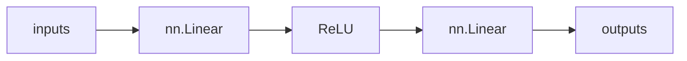

7장 이하는 모두 은닉층이 존재하지 않는 machine learning model을 다룬 것이다. 사용하는 예측함수나 손실함수의 차이는 있지만 모두 하나의 선형 함수를 사용했다.

<br>

8장부터 처음으로 (예측 함수에) 은닉층이 존재하는 deep learning model을 다룬다. **두 개 이상의 선형 함수 사용**

<br>



<br>

앞서 살펴 보았듯 선형 함수만 합성 함수로 이어주면 또다른 선형 함수가 될 뿐이다. 따라서 선형 함수에 ReLU와 같은 activation function (활성화 함수, 비선형 함수) 을 적용해야 한다.
<br>
**cf) Sigmoid 활성화 함수 대신 ReLU를 사용하는 이유**

Sigmoid 함수의 경우 신경망이 깊어질수록(은닉층이 많을수록) 경사도가 소실(0으로 수렴)되는 문제가 발생한다. 따라서 학습이 원활히 일어나지 않는다. 반면 ReLU 함수는 입력값이 양이기만 하면 경사 값을 보존(y=x)하기 때문에 경사도 소실이 나타나기 더 어렵다.

## PyTorch에서 GPU 사용 방법

### GPU 디바이스 할당

PyTorch는 항상 디바이스를 **명시적으로 할당**해주어야 함

```python
device = torch.device("cuda" if torch.cuda.is_available() else "cpu")
print(f"Using device: {device}")
```


### GPU 사용 규칙

- 모든 텐서 변수는 GPU와 CPU 중 어디에 속하는지를 속성으로 갖고 있음
- CPU와 GPU는 `to` 메서드를 통해 서로 변환 가능
  - `tensor.to(device)`
- 모든 텐서 변수의 속성이 GPU면 GPU로 연산
- 모든 텐서 변수의 속성이 CPU면 CPU로 연산
- 다를 경우, 에러 발생
  - `RuntimeError: Expected all tensors to be on the same device, but found at least two devices, cuda:0 and cpu! `

**net 인스턴스** 또한 모델 파라미터(텐서 변수)를 갖고 있기 때문에 어느 디바이스에 속하는지 신경써야 함

```python
net = Net(n_input, n_hidden, n_output).to(device)
```


#### cf) (데이터) 전처리란
학습 데이터를 모델에 입력하기 전에 필요에 따라 가공하는 과정

<br>

## MNIST의 입력 layer [100, 784]의 의미:

1. MNIST의 총 데이터 수는 60,000개임
2. 그러나 전체 60,000개의 데이터를 한 번에 학습하는 것은 메모리 부족 문제가 발생할 수 있음. 또 한 번의 반복 처리에 시간이 너무 많이 드는 문제가 있음.
3. 따라서 데이터를 100개씩 묶어서 학습하는 것이 일반적임. 이를 미니 배치 학습법이라고 함.
4. 이때 100개씩 묶은 데이터를 배치(batch)라고 함. batch는 데이터를 묶는 단위인 거임.
5. 784는 28x28 크기의 화소 수를 말함
6. 출력 layer [100, 10]이란, 배치 사이즈의 데이터에서 픽셀을 바탕으로 10개의 결과 중 하나로 분류하는 것을 말함(다중분류)
7. 한 epoch는 60,000개의 데이터 전부를 학습하는 것을 말함.
8. 즉 1번 ~ 100번 데이터 학습 후 101번 ~ 200번 데이터 학습 ... 이런 식으로 60,000개의 데이터를 전부 학습하는 것을 말함.
9. 그러나 똑같은 데이터를 똑같은 순서로 학습시키면 과적합(overfitting)이 발생할 수 있음.
10. 따라서 데이터를 무작위로 섞어서 학습하는 것이 일반적임. 즉 각 반복처리마다 데이터가 학습되는 양은 같지만 학습 순서(집단)는 무작위로 바뀌는 것임.

<br>

#### cf) 미니 배치 학습법을 사용하면 경사 하강법의 계산 결과가 local minima에 빠지는 것을 방지할 수 있음.
  - 왜 그럴까? : 무작위 선택은 확률적 특성(무작위성)을 가지므로 동일한 local minima에 빠지는 것을 방지할 수 있음. (**아직 100% 이해는 못 함**)

<br>

# MNIST 모델 구현 및 학습

*실제 반복 처리(epoch) 기준으로 설명*
<br>
## 1. 데이터 준비

### 1.1. MNIST dataset 불러오기
##### cf) MNIST 관련 이슈

현재 교재에 적힌 코드 대로 진행할 때는

```python
import torchvision.datasets as datasets
  
data_root = './data'
  
train_set0 = datasets.MNIST(
    root = data_root,
    train = True,
    download = True
)
```


```bash
Downloading [http://yann.lecun.com/exdb/mnist/train-images-idx3-ubyte.gz](http://yann.lecun.com/exdb/mnist/train-images-idx3-ubyte.gz) Failed to download (trying next): <urlopen error [Errno 110] Connection timed out>
```

오류가 발생함 -> 이는 yann.lecun.com이 현재 접속 불가한 상태이기 때문.
이후 자동으로 다른 route으로 다운받기는 하나, 시간이 굉장히 오래 걸림 (약 8분)
<br>
**해결방법:** 
```python
import torchvision.datasets as datasets
import urllib.request
import socket

socket.setdefaulttimeout(5)

data_root = './data'

train_set0 = datasets.MNIST(
    root = data_root,
    train = True,
    download = True
)
```

5초 안에 안 되면 넘어가게

<br>

### 1.2. 데이터 전처리

**1.2.1. ToTensor**

`ToTensor` 메서드는 데이터를 텐서화하는 동시에 **최소 0에서 최대 1 사이의 값을 갖게 한다.**

**1.2.2. Normalize**

전체 데이터가 최소 0에서 최대 1 사이의 값을 가질 때 Normalize(0.5, 0.5)를 통해 데이터가 -1 에서 1 사이에 위치하게 정규화할 수 있다.

**1.2.3. Lambda Class 를 통한 1차원으로 텐서 변환**

```python
transform = transforms.Compose([
    # 데이터를 텐서로 변환
    transforms.ToTensor(),
    # 데이터 정규화 -> (-1,1) 사이에 위치
    transforms.Normalize(0.5, 0.5),
    # 현재 텐서를 1계 텐서로 변환
    transforms.Lambda(lambda x: x.view(-1)),
])


# 훈련용 데이터셋 정의
train_set = datasets.MNIST(
    root = data_root, train = True,
    download = True, transform = transform)

# 검증용 데이터셋 정의
test_set = datasets.MNIST(
    root = data_root, train = False,
    download = True, transform = transform)
```

MNIST의 train_set은 60,000개, test_set은 10,000개이다.
<br>
**cf) Lambda Expression Playground**

ex.
```python
g = lambda x: 2 * x**2 + 2
```

lambda 표현식을 사용하는 이유: 한 번 쓰이는 함수의 이름을 굳이 정할 필요 없이 간결하게 쓸 수 있기 때문.

lambda 궁금한 점:

1. if 사용이 힘들던데 만약에 복잡한 조건문을 쓸 때 어떻게 표현할 수 있는가?

   1. **삼항 연산자 사용**
   ```python
   lambda x: a if condition else b
   ```
   
   2. **and/or 연산자 사용**
   ```python
   lambda x: condition1 and value1 or value2
   ```
   
   3. **여러 조건의 경우**
   ```python
   lambda x: a if condition1 else (b if condition2 else c)
   ```

하지만 조건문이 매우 복잡한 경우, 일반 함수를 사용하는 것이 가독성이 더 좋음.


2. boolean의 경우 이런 식으로 해봤는데 맞는지 궁금함

```python
is_positive: bool = lambda x: x>0

print(is_positive(-5))
print(is_positive(10))
```
	-> good

<br>
### 1.3. Mini batch data 생성

```python
# 라이브러리 임포트
from torch.utils.data import DataLoader

# 미니 배치 사이즈 지정
batch_size = 500

# 훈련용 데이터로더
# 훈련용이므로, 셔플을 적용함

train_loader = DataLoader(
    train_set, batch_size = batch_size,
    shuffle = True)

# 검증용 데이터로더
# 검증시에는 셔플을 필요로하지 않음

test_loader = DataLoader(
    test_set,  batch_size = batch_size,
    shuffle = False)
```

Mini Batch 가 필요한 이유는 위의 `MNIST의 입력 layer [100, 784]의 의미` 참고
batch size는 500으로 설정했다.
<br>
## 2. 모델 정의 및 초기화 처리

### 2.0. 입력, 출력, 은닉 차원 설정 (input, output, hidden)

```python
n_input = image.shape[0]
n_output = len(set(list(labels.data.numpy())))
n_hidden = 128
```

recap) 모델 정의를 위해서는 항상 먼저 입,출력값을 설정해야 한다.

가장 위에서 설명했듯, 8장 MNIST 부터는 hidden layer가 포함된 Deep learning에 대해 다룬다.

<br>

### 2.1. 예측 모델 정의

```python
class Net(nn.Module):
	def __init__(self, n_input, n_output, n_hidden):
		super().__init__()
		self.l1 = nn.Linear(n_input, n_hidden)
		self.l2 = nn.Linear(n_hidden, n_output)
		self.relu = nn.ReLU(inplace=True)

	def forward(self, x):
		x1 = self.l1(x)
		x2 = self.relu(x1)
		x3 = self.l2(x2)
		return x3
```

recap) 예측 함수(Net)는 `__init__()`와 `forward()` 로 이루어져 있다.
<br>
해당 예측 모델이 7장 이전의 모델과 다른 점은 두 가지인데
1. hidden layer가 추가됐다.
	- 그에 따라 선형함수가 둘로 늘어났다.
	- 여기서 l1과 l2 사이에 ReLU가 없을 경우, 아무리 많은 선형함수를 합성해도 선형함수일 뿐이므로 비선형적으로 활성화하는 ReLU가 들어갔다.
	- 두 개의 선형함수인데 하나의 활성화 함수만 있는 이유는 두 번째 활성화 함수가 손실함수 쪽에 있기 때문이다.
<br>
2. l1,l2 의 weight와 bias를 따로 설정하지 않고 random하게 나오도록 설정했다.
	- 만약 모든 설정값을 1로 둔다면 **파라미터 수가 방대하여 학습이 잘 이루어지지 않는다**고 한다. -> 왜 이런지는 아직 잘 모르겠음, 그리고 이럴거면 왜 앞에서는 굳이 1로 설정했는지도 모르겠음
<br>
### 2.2. 예측 모델 초기화

```python
net = Net(n_input, n_output, n_hidden).to(device)
```

to(device) 를 통해 예측 함수 인스턴스를 GPU로 계산하게끔 한다.

<br>
recap) 파라미터 확인

```python
print(net)

for parameter in net.named_parameters():
	print(parameter)

print(summary(net, (784,)))
```

이런 방법들로 net의 파라미터 구성을 확인할 수 있다.

이때 1) l1,l2,relu를 확인할 수 있고 2) Weight, Bias가 난수로 설정됐음을 다시 한 번 확인할 수 있다.

<br>
### 2.3. 손실 함수 정의

```python
criterion = nn.CrossEntropy()
```

MNIST 또한 다중 분류 과제에 해당하기 때문에 7장과 마찬가지로 교차 엔트로피 함수를 사용한다.
(예측 함수와 손실 함수를 구성하는 세 가지 방법에 대해서는 좀 더 공부하고 정리해야 할듯)

<br>
### 2.4. 최적화 함수 정의

```python
lr = 0.01
optimizer = optim.SGD(net.parameters(), lr=lr)
```

recap) 최적화 함수에서 가장 중요한 것은 lr(learning rate)!

<br>
### 2.5. 반복 횟수 설정

```python
num_epochs = 100
```
<br>
### 2.5. 평가 결과 기록
```python
history = np.zeros((0,5))
```

총 5개의 행이 필요한 이유: 1) epoch 횟수 2) train loss 3) train accuracy 4) test loss 5) test accuracy 

이때 2) train loss은 실제 파라미터 개선에 사용되고 4) test loss 는 평가 지표로만 사용된다. (바로 뒤의 반복 처리 코드 참고)

<br>
## 3. 반복 처리

*코드 작성을 한 번에 하고 설명을 아래에 하겠음*
*간단한 설명은 각주를 이용*

```python
# tqdm은 훈련 진행 상황의 시각화에 사용됨
from tqdm.notebook import tqdm

for epoch in range(num_epochs):
	train_correct, train_loss = 0,0 # 뒤에서 설명
	val_correct, val_loss = 0,0
	n_train, n_loss = 0,0 # mini batch로 인해 생긴 variables

	for inputs, labels in tqdm(train_loader): # 뒤에서 설명
		n_train += len(labels) # 누적된 결과가 사실상 전체 train dataset
		
		inputs = inputs.to(device)
		outputs = outputs.to(device)
		
		optimizer.zero_grad()
		
		outputs = net(inputs)
		loss = criterion(outputs, labels)
		loss.backwards()
		optimizer.step()
		
		predicted = torch.max(outputs, 1)[1] # 뒤에서 설명
		
		train_loss += loss.item()
		train_correct += (predicted == labels).sum().item()
	
	for inputs_test, labels_test in tqdm(test_loader):
		n_test += len(labels) # 전체 test dataset
		
		inputs_test = inputs_test.to(device)
		outputs_test = outputs_test.to(device)
		
		optimizer.zero_grad()
		
		outputs_test = net(inputs_test)
		loss_test = criterion(outputs_test, labels_test)
		
		predicted_test = torch.max(outputs_test, 1)[1]
		
		val_loss += loss_test.item()
		val_correct += (predicted_test == labels).sum.item()

	train_acc = train_correct / n_train
	val_acc = val_correct / n_test
	
	print(f'Epoch [{epoch+1}/{num_epochs], loss: {train_loss: .5f} val_loss: {val_loss: .5f}, val_acc: {val_acc: .5f}')
	item = np.array([epoch+1, train_loss, train_acc, val_loss, val_acc])
	history = np.vstack((history, item))
```

**1. 이중 for문 구조인 이유**
7장 이하의 경우, dataset의 크기가 크지 않았기 때문에 mini batch로 나눌 필요가 없었다. 때문에 한 epoch 내에서는 for문이 필요 없었다.
<br>
그러나 mini batch가 생긴 이후로는

- 첫 번째 for문: num_epoch의 수 만큼 반복
- 두 번째 for문: (각 epoch 내에서) 모든 mini batch의 수 만큼 반복(train, test 각각)
<br>
이 때문에 이중 for문이 된 것이다.
<br>
**2. correct, loss 초기화 하는 이유**

7장 이하에서는 mini batch로 나누지 않았기 때문에 각 epoch마다 loss, acc에 대해 값을 할당(Ex. `train_loss = loss.item()`)하면 됐다. mini batch를 도입하게 되면서 loss, correct에 대해 **누적**을 할 필요가 생긴다. 왜냐하면 모든 mini batch의 loss, correct를 더해야 하나의 epoch이 완성되기 때문.
따라서 **각 epoch마다 0으로 초기화한 후 해당 epoch이 끝날 때까지 mini batch들의 loss와 correct를 누적하여 더하는 방식으로 진행되는 것이다.**
<br>
**3. `for inputs, labels in tqdm(train_loader)`, `for inputs_test, labels_test in tqdm(test_loader)`에 대한 설명

`tqdm`은 `train or test datset / batch size`를 기준(분모)으로 total batch 중 얼마나 훈련이 됐는지 시각화해주는 method다.

Ex. MNIST의 경우 train_set은 60,000, batch_size는 500 이므로 total train batch는 120이 될 것이다.

시각화해준다는 것만 추가되는 것이고 의미는

`for inputs, labels in train_loader`, `for inputs_test, labels_test in test_loader`와 같다.
<br>
**4. `predicted = torch.max(outputs, 1)[1]`에 대한 설명**

이 부분은 '**어차피 손실함수인 교차 엔트로피 함수를 적용하기 전에도 예측함수를 통해(outputs) 가장 크게 나타난 값이 예측결과가 된다**'는 아이디어에서 비롯됐다.
이는 교차 엔트로피 함수가 예측함수의 결과(outputs)에 로그함수를 적용한 후 가장 큰 값의 정답요소를 추출하는 것이기 때문이다.

이때 torch.max(outputs, 1)을 하면 예측함수 결과의 실제 값(values)과 위치(indices)가 나타난다. outputs의 실제 값에 대해서는 관심이 없고 **예측함수의 결과가 어떤 출력기에서 가장 큰지 알고 싶은 것**이기 때문에 위치값인 indices만 가져온다. 여기서 위치값은 곧 '**어떤 출력기를 선택했는지**'와 같은 말이다.
<br>
**recap**) test_loader에 대해서는 loss_test.backward(), optimizer.step() 이 생략된다. 
test dataset은 학습(파라미터 갱신)에 사용되지 않기에 **경사 계산 및 파라미터 갱신을 하면 안 된다**.


<br>

## cf) 은닉층이 추가된 모델

```python
class Net2(nn.Module):
	def __init__(n_input, n_output, n_hidden):
		super().__init__()
		self.l1 = nn.Linear(n_input, n_hidden)
		self.l2 = nn.Linear(n_hidden, n_hidden)
		self.l3 = nn.Linear(n_hidden, n_output)
		self.relu = nn.ReLU()

	def forward(self, x):
		x1 = self.l1(x)
		x2 = relu(x1)
		x3 = self.12(x2)
		x4 = relu(x3)
		x5 = self.13(x5)
		return x5
```


## impact of batch size

mini batch 학습에서 batch size는 매우 중요한 tuning parameter다.
결론만 말하면 **일반적으로 batch size가 작을수록 정확도가 높아진다.**