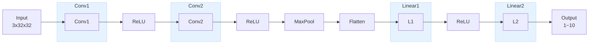

## CNN INTRO
<br>
기존 model들과의 가장 큰 차이이자 가장 중요한 두 개의 키워드를 꼽는다면 **convolutional layer**와 **pooling layer**이다.

### 합성곱 처리 (Convolutional layer)

Fully Connected Nerual Network(전결합형)인 MLP 와 달리 CNN에서는 정방형(`n×n`)의 kernel이 모델의 parameter(weight)가 된다. 

이때 Convolutional layer에서는 **kernel보다 큰 크기의 이미지를 kernel size 만큼 자른 후 kernel의 가중치(weight)를 곱하여 출력한다.**

따라서 input과 전부 연합된 모델에 비해 훈련이 필요한 parameter가 획기적으로(n<sup>2</sup>) 줄어든다.
<br>
### 풀링 처리 (Pooling layer)

`m×m`의 크기로 자른 후(`n×n`의 크기와 독립적임) 자른 영역에서의 최댓값(max pooling) 혹은 평균값(average pooling)만 추출하고 나머지(m×m-1)는 버리는 것.


> 풀링 처리를 통해 이미지를 축소하는 것과 동일한 효과를 얻을 수 있다.
<br>
## CNN의 전형적인 구성 예시


<br>
- 파란색으로 표시한 부분들은 parameter가 존재하는 layer들이다.
- 구조를 살펴보면 1) convolution layer, pooling layer를 지나 flattern(1계화)한 후 2) 선형 함수를 적용하여 결과를 얻는 구조이다.
- 사용되는 layer들: `nn.Conv2d`, `nn.MaxPool2d`, `nn.Flatten`, `nn.ReLU`, `nn.Linear`
<br>

### 1. nn.Conv2d

**cf) 왜 Conv, MaxPool 뒤에 '2d'라는 표현이 붙었을까?**

이미지 데이터의 경우 height × width의 2차원 구조로 처리되므로 2d라는 표현이 붙음.

참고로:
- Conv1d: 시계열 데이터와 같은 1차원 데이터 처리
- Conv2d: 이미지와 같은 2차원 데이터 처리
- Conv3d: 비디오나 3D 이미지와 같은 3차원 데이터 처리

<br>

```python
# stride 명시적 지정
conv1 = nn.Conv2d(3, 32, kernel_size=3, stride=(1,1))  # 기본값
conv2 = nn.Conv2d(3, 32, kernel_size=3, stride=(2,2))  # 2칸씩 이동

# stride 생략 (기본값 1,1 적용)
conv3 = nn.Conv2d(3, 32, kernel_size=3)
```

각 param은

1) number of input channels (Ex.3)
2) number of output channels (Ex.32)
3) kernel size (Ex.3)

*stride는 생략시 기본값 1,1 적용*

을 의미한다.
<br>
**`conv1.weight.shape`이 `[32,3,3,3]` 인 이유**

각각은

1) number of output channel
2) number of input channels
3) kernel height
4) kernel weight

(*주로 정방형(n x n)의 kernel을 사용하기 때문에 3, 4는 주로 같게 나온다.*)

을 의미한다.
<br>

### 2. nn.MaxPool2d

```python
maxpool = nn.MaxPool2d((2,2))
```
2 x 2 의 화소를 통해 축소하겠다는 것이다.

<br>


dry 하게 보면 이해가 잘 안 되므로 예시를 통해 이해하는 것이 더 직관적이다.
<br>
화소를 나타내는 대표적인 삼원색인 Red, Green, Blue 를 각각의 채널로 설정했을 때, input channel의 수는 3개가 된다. 이후 kernel를 통해 예측(forward)을 하고 output channel을 출력한다.
<br>
output channel 각각은 input을 바탕으로 한 특징(feature)들이다. 이미지를 예시로 들면 texture(질감), edge(경계), color(색상), shape(모양) 등이 있다. 즉 각각의 채널은 중점적으로 어떠한 feature를 감지하는 데 특화돼 있다.
<br>
32개의 출력 채널은 초기에는 무작위로 초기화되고, 학습 과정에서 입력 데이터와 손실 함수를 통해 점진적으로 특정 특징을 추출하는 방향으로 업데이트됩니다. 즉 **자동적으로 특징을 학습**하는 것이 특징이다.
<br>
그 과정에 있어 상관관계가 높은 출력 채널이 있는지 궁금했다. 실제로 그럴 가능성이 있다고 하고 그 단점으로 **중복성**과 **과적합**이 있다고 한다. 중복성이란, 거의 같은 정보를 출력하는 것이기 때문에 모델의 효율성이 떨어짐을 의미하는 것이고 과적합은 학습 데이터셋에만 정확도가 높고 일반화가 잘 되지 않는 것을 말한다.
<br>
출력 채널 간의 동질성에서 나타날 수 있는 문제를 해소하고자 정규화 기법, 드롭아웃, 채널 독립성을 명시적으로 고려하는 손실함수 등을 사용할 수 있다.
<br>
**CNN에서 함수를 출력할 때 나오는 배열은**

1) number of data
2) number of channel (Ex. conv 함수에서 정의된 출력 채널)
3) kernel height
4) kernel weight

Ex.

```python
# CNN 전반부 처리 시뮬레이션

x1 = conv1(inputs)
x2 = relu(x1)
x3 = conv2(x2)
x4 = relu(x3)
x5 = maxpool(x4)

# nn.Sequential 을 사용해도 같은 결과를 얻을 수 있음

# 각 변수의 shape 확인

print(inputs.shape)
print(x1.shape)
print(x2.shape)
print(x3.shape)
print(x4.shape)
print(x5.shape)

# 결과
"""
torch.Size([100, 3, 32, 32])
torch.Size([100, 32, 30, 30])
torch.Size([100, 32, 30, 30])
torch.Size([100, 32, 28, 28])
torch.Size([100, 32, 28, 28])
torch.Size([100, 32, 14, 14])
"""
```

1. conv1, conv2에서 2씩 줄어드는 이유: 합성곱(Convolution) 처리할 때마다 `kernel size - 1` 만큼 height, weight이 줄어들기 때문
2. maxpool에서 절반이 줄어든 이유: pooling 만큼(2×2) 줄어든 거임
3. 원래 CIFAR-10 dataset은 3 channel, 32×32 화소로 구성돼 있음.

<br>

### 3. nn.Sequential

`nn.Sequential`은 여러 함수가 **직렬**로 연결된 **합성 함수**이다.

```python
features = nn.Sequential(
    conv1,
    relu,
    conv2,
    relu,
    maxpool
)
```

<br>

### 4. nn.Flatten

```python
flatten = nn.Flatten()
outputs2 = flatten(outputs)
print(outputs.shape)
print(outputs2.shape)

# 결과
"""
torch.Size([100, 32, 14, 14])
torch.Size([100, 6272])
"""
```

`nn.Flatten()`은 다차원 텐서를 더 낮은 차원으로 평탄화하는 연산을 수행한다. 기본적으로 `start_dim=1`부터 마지막 차원까지 모든 차원을 하나로 병합한다 (dl의 경우 주로 복수의 batch를 처리하기 때문에 start_dim을 명시적으로 1 이외의 값으로 지정하는 경우는 드물다).

예를 들어 shape이 `[100, 32, 14, 14]`인 텐서를 평탄화하면:
- 첫 번째 차원(100)은 유지
- 나머지 차원(32 × 14 × 14 = 6,272)을 모두 곱해서 하나의 차원으로 변환
- 결과: `[100, 6272]`

주로 **CNN의 합성곱 층에서 추출한 특징들을 완전연결층(Fully Connected Layer)에 전달하기 위해 사용**된다.

For more specific information: check https://cs231n.github.io/convolutional-networks/#overview

<br>

## 공통 함수

### 1. eval_loss

목적: 주로 손실 그래프의 시각화 등에 사용됨

```python
def eval_loss(loader, device, net, criterion):
    for images, labels in loader:
        break
    
    inputs = images.to(device)
    labels = images.to(device)

    outputs = net(inputs)
    loss = criterion(outputs, labels)

    return loss
```

<br>

### 2. fit

목적: 모델 학습에 사용됨 (필자의 경우 scikit-learn을 미리 배운 독자를 고려해 이런 이름을 사용한 것으로 보임)

```python
def fit(net, optimizer, criterion, num_epochs, train_loader, device, history):

    from tqdm.notebook import tqdm

    base_epochs = len(history)
    
    for epoch in range(base_epochs, num_epochs+base_epochs):
        train_loss = 0
        train_acc = 0
        val_loss = 0
        val_acc = 0

        # 훈련 페이즈
        net.train()
        count = 0

        for inputs, labels in tqdm(train_loader):
            count += len(labels)
            inputs = inputs.to(device)
            labels = labels.to(device)

            optimizer.zero_grad()
            outputs = net(inputs)
            loss = criterion(outputs, labels)
            train_loss += loss.item()
            loss.backward()
            optimizer.step()

            predicted = torch.max(outputs, 1)[1]
            train_acc += (predicted == labels).sum().item()

            avg_train_loss = train_loss / count
            avg_train_acc = train_acc / count

        # 예측 페이즈
        net.eval()
        count = 0

        for inputs, labels in test_loader:
            count += len(labels)
            inputs = inputs.to(device)
            labels = labels.to(device)

            outputs = net(inputs)
            loss = criterion(outputs, labels)
            val_loss += loss.item()

            predicted = torch.max(outputs, 1)[1]
            val_acc += (predicted == labels).sum().item()

            avg_val_loss = val_loss / count
            avg_val_acc = val_acc / count

        print (f'Epoch [{(epoch+1)}/{num_epochs+base_epochs}], loss: {avg_train_loss:.5f} acc: {avg_train_acc:.5f} val_loss: {avg_val_loss:.5f}, val_acc: {avg_val_acc:.5f}')
        item = np.array([epoch+1, avg_train_loss, avg_train_acc, avg_val_loss, avg_val_acc])
        history = np.vstack((history, item))
    return history
```

**Q. 처음 시작 시 history가 없으면 어떡함?**

A. 그래서 맨 처음에 history = np.zeros((5)) 로 설정해주는 거임.


**net.train(), net.eval()**

- 부모 클래스인 `nn.Module`에서 정의된 메서드
- 모델의 훈련 페이즈와 예측 페이즈를 전환하는 역할
- **훈련 페이즈**: 모델의 파라미터를 업데이트하는 데 사용
- **예측 페이즈**: 모델의 파라미터를 업데이트하지 않고 예측만 수행하는 데 사용

<br>

### 3. evaluate_history

목적: 학습 / 예측의 결과를 시각화하는 데 사용됨
history만을 param으로 가짐.

```python
def evaluate_history(history):
    print(f'초기상태 : 손실 : {history[0,3]:.5f}  정확도 : {history[0,4]:.5f}')
    print(f'최종상태 : 손실 : {history[-1,3]:.5f}  정확도 : {history[-1,4]:.5f}' )

    num_epochs = len(history)
    unit = num_epochs / 10

    plt.figure(figsize=(9,8))
    plt.plot(history[:,0], history[:,1], 'b', label='훈련')
    plt.plot(history[:,0], history[:,3], 'k', label='검증')
    plt.xticks(np.arange(0,num_epochs+1, unit))
    plt.xlabel('반복 횟수')
    plt.ylabel('손실')
    plt.title('학습 곡선(손실)')
    plt.legend()
    plt.show()

    plt.figure(figsize=(9,8))
    plt.plot(history[:,0], history[:,2], 'b', label='훈련')
    plt.plot(history[:,0], history[:,4], 'k', label='검증')
    plt.xticks(np.arange(0,num_epochs+1,unit))
    plt.xlabel('반복 횟수')
    plt.ylabel('정확도')
    plt.title('학습 곡선(정확도)')
    plt.legend()
    plt.show()
```

<br>

### 4. show_images_labels

목적: 예측한 이미지가 실제로 맞았는지 샘플을 뽑아 확인하는 데 사용됨

```python
def show_images_labels(loader, classes, net, device):

    for images, labels in loader:
        break
    n_size = min(len(images), 50)

    if net is not None:
      inputs = images.to(device)
      labels = labels.to(device)

      outputs = net(inputs)
      predicted = torch.max(outputs,1)[1]
      #images = images.to('cpu')

    plt.figure(figsize=(20, 15))
    for i in range(n_size):
        ax = plt.subplot(5, 10, i + 1)
        label_name = classes[labels[i]]
        if net is not None:
          predicted_name = classes[predicted[i]]
          if label_name == predicted_name:
            c = 'k'
          else:
            c = 'b'
          ax.set_title(label_name + ':' + predicted_name, c=c, fontsize=20)
        else:
          ax.set_title(label_name, fontsize=20)
        image_np = images[i].numpy().copy()
        img = np.transpose(image_np, (1, 2, 0))
        img = (img + 1)/2
        plt.imshow(img)
        ax.set_axis_off()
    plt.show()
```

<br>

## CNN: 데이터 준비부터 예측까지

### 1. 데이터 준비

**1-1. Transforms 정의**

```python
# MLP와 다르게 1계 텐서화하지 않는다.
transform = transforms.Compose([
    transforms.ToTensor(),
    transforms.Normalize(0.5, 0.5)
])
```
<br>

**1-2. CIFAR-10 데이터셋 정의**

```python
train_set = dataset.CIFAR10(
    root = './data',
    train = True,
    transform = transform
)

test_set = dataset.CIFAR10(
    root = './data',
    train = False,
    transform = transform
)
```
<br>

**1-3. DataLoader(for mini batch) 정의**

```python
image, label = train_set[0]
print(image.shape)
print(label)

batch_size = 100

train_loader = DataLoader(train_set, batch_size, shuffle=True)
test_loader = DataLoader(test_set, batch_size, shuffle=False)

for images, labels in train_loader:
    break

print(images.shape)
```

<br>

**1-4. 검증 데이터 이미지로 표시**

```python
classes = ('plane', 'car', 'bird', 'cat', 'deer', 'dog', 'frog', 'horse', 'ship', 'truck')
show_images_labels(test_loader, classes, None, None)
```

<br>

### 2. 모델 정의

**2-1. 모델 클래스 (예측 함수) 정의**

```python
class CNN(nn.Module):
    def __init__(self, n_output, n_hidden):
        super().__init__()
        self.conv1 = nn.Conv2d(3,32,3)
        self.conv2 = nn.Conv2d(32,32,3)
        self.relu = nn.ReLU(inplace=True)
        self.maxpool = nn.MaxPool2d((2,2))
        self.flatten = nn.Flatten()
        self.l1 = nn.Linear(6272, n_hidden) # 6272 = 32 * 14 * 14
        self.l2 = nn.Linear(n_hidden, n_output)

        self.features = nn.Sequential(
            self.conv1,
            self.relu,
            self.conv2,
            self.relu,
            self.maxpool
        )

        self.classifier = nn.Sequential(
            self.l1,
            self.relu,
            self.l2
        )

    def forward(self, x):
        x1 = self.features(x)
        x2 = self.flatten(x1)
        x3 = self.classifier(x2)
        return x3
```

<br>

**2-2. 모델 개요 표시**

```python
print(net)
summary(net,(100,3,32,32),depth=1)

loss = eval_loss(test_loader2, device, net, criterion)
g = make_dot(loss, params=dict(net.named_parameters()))
display(g)
```

<br>

### 3. 모델 초기화와 학습

```python
net = CNN(n_output = 10, n_hidden = 100).to(device)
criterion = nn.CrossEntropyLoss()
lr = 0.01
optimizer = optim.SGD(net.parameters(), lr=lr)
num_epochs = 50
history = np.zeros((0,5))

history = fit(net, optimizer, criterion, num_epochs, train_loader, device, history)
```

<br>

### 4. 학습 결과 평가

```python
evaluate_history(history)
```
